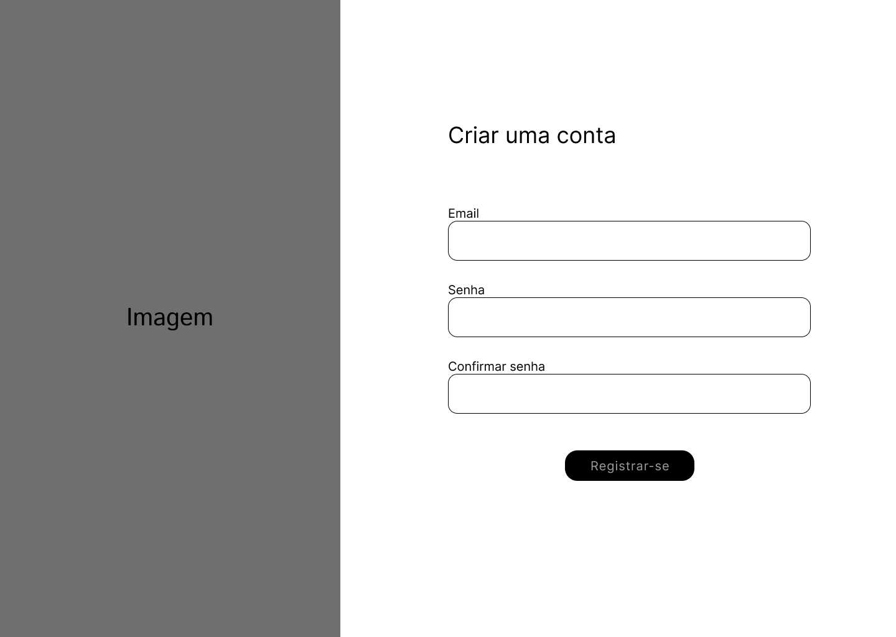
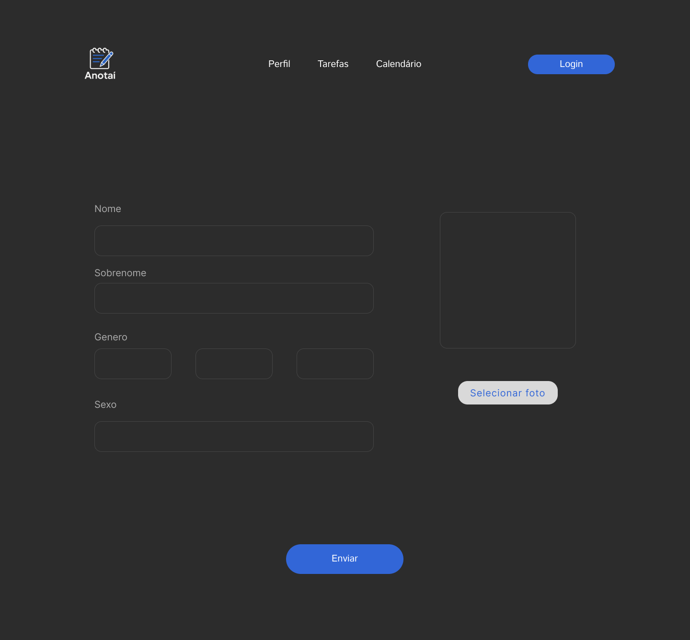

# Projeto de interface

Pré-requisitos: <a href="02-Especificacao.md"> Especificação do projeto</a>

Visão geral da interação do usuário pelas telas do sistema e protótipo interativo das telas com as funcionalidades que fazem parte do sistema (wireframes).

 Apresente as principais interfaces da plataforma. Discuta como ela foi elaborada de forma a atender os requisitos funcionais, não funcionais e histórias de usuário abordados na <a href="02-Especificacao.md"> Especificação do projeto</a>.

 ## User flow

O projeto de fluxo de usuário, visa permitir a navegação em busca de playlists de metas e o gerenciamento da mesma, utilizando soluções simples e interativas para um fácil entendimento e melhor experiência dos consumidores.

## Diagrama de fluxo

Os diagramas a seguir representam o fluxo de navegação dos usuários no sistema Anotaí, contemplando dois perfis distintos: usuários padrão e usuários avançados, com percursos distintos que se complementam dentro do sistema.

### Usuário Padrão:

O fluxo a seguir envolve funcionalidades essenciais da plataforma, como realizar cadastro, efetuar login, podendo criar metas individuais, além de acompanhar seu progresso.
 

### Usuário Avançado:

O fluxo a seguir possui um fluxo que engloba todas as ações do usuário Padrão, com a adição de funcionalidades de publicação de playlists de metas, podendo monetizar-las ou não.

## Wireframes

#### Tela Inicial:

#### Registrar-se:

#### Entrar:

#### Perfil:

#### Home:

#### Criação de Metas:

#### Playlists de Metas:

#### Meta:

 
## Interface do sistema

### Tela Principal do Sistema

Tela inicial Anotaí

### Processo 1 

Criação de Perfil

### Processo 2

Criação de Metas

### Vizualização das Playlists

Playlists de Metas

### Vizualização de Metas

Meta aberta

