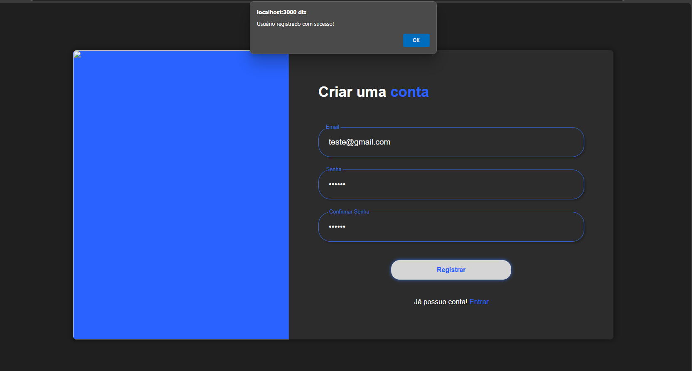
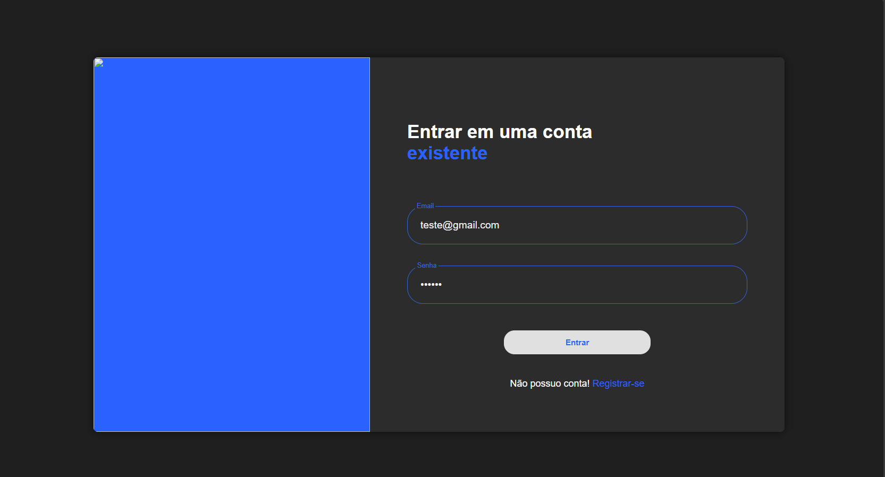
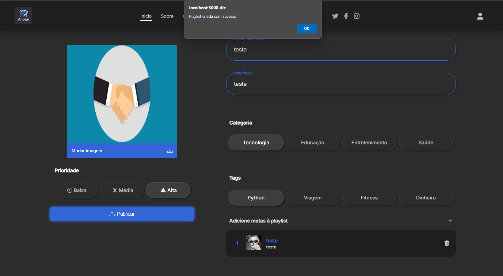
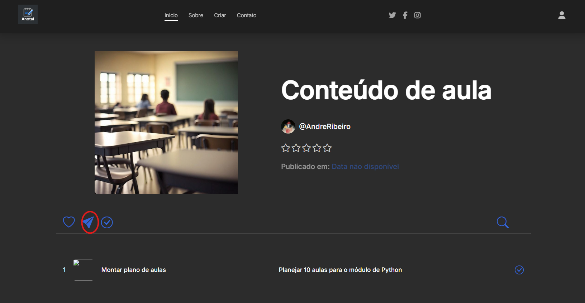
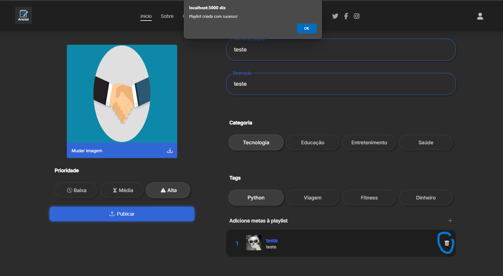
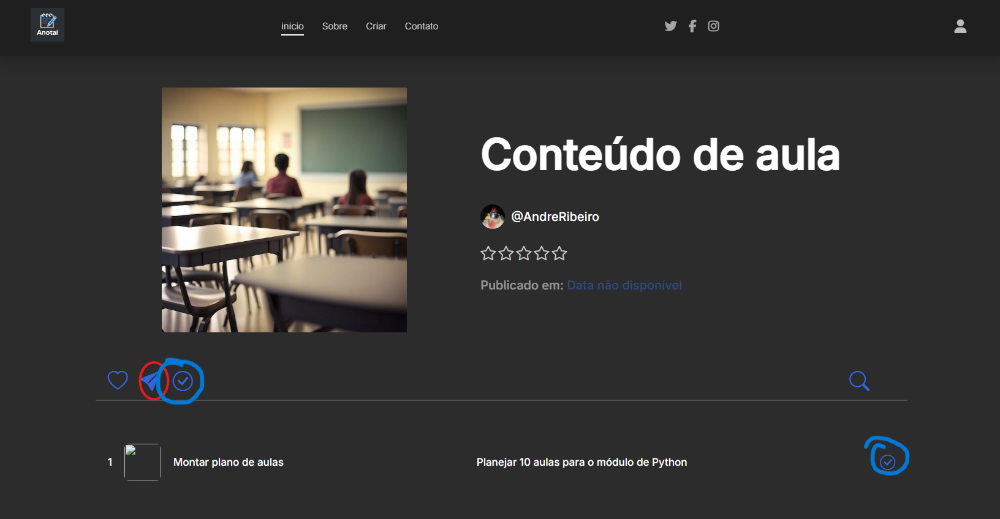
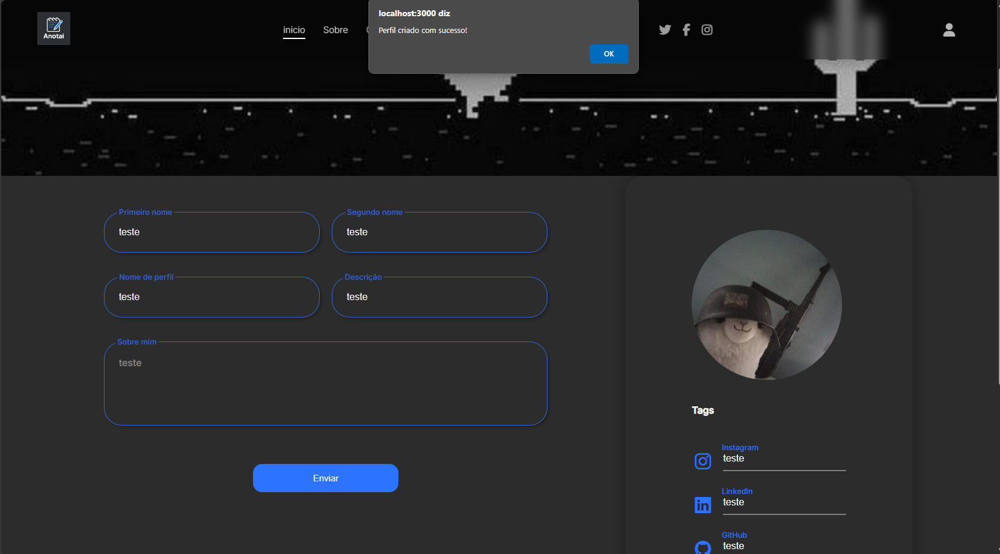
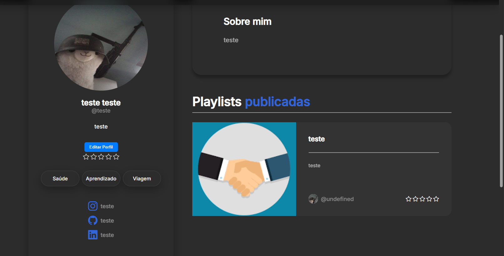

# Registro de testes de software

Pré-requisitos: <a href="04-Projeto-interface.md"> Projeto de interface</a>, <a href="07-Plano-testes-software.md"> Plano de testes de software</a>

Relatório com as evidências dos testes de software realizados no sistema pela equipe, baseado em um plano de testes pré-definido.

Para cada caso de teste definido no <a href="07-Plano-testes-software.md"> Plano de testes de software</a>, realize o registro das evidências dos testes feitos na aplicação pela equipe, que comprovem que o critério de êxito foi alcançado (ou não!). Para isso, utilize uma ferramenta de captura de tela que mostre cada um dos casos de teste definidos. Observação: cada caso de teste deverá possuir um vídeo do tipo _screencast_ para caracterizar uma evidência do referido caso.

| **Caso de teste** 	| **CT-001 – Cadastro de usuários** 	|
|:---:	|:---:	|
| Requisito associado | RF-001 - A aplicação deve permitir o cadastro de novos usuários. |
| Registro de evidência |  |

| **Caso de teste** 	| **CT-002 – Login e autenticação** 	|
|:---:	|:---:	|
| Requisito associado | RF-002 - A aplicação deve permitir que usuários cadastrados façam login. |
| Registro de evidência |  |

| **Caso de teste** 	| **CT-003 – Criar metas** 	|
|:---:	|:---:	|
| Requisito associado | RF-003 - A aplicação deve permitir que usuários criem metas. |
| Registro de evidência |  |

| **Caso de teste** 	| **CT-004 – Definir prioridades** 	|
|:---:	|:---:	|
| Requisito associado | RF-004 - A aplicação deve permitir que usuários definam prioridades para suas metas. |
| Registro de evidência |  |

| **Caso de teste** 	| **CT-005 – Organização por categorias** 	|
|:---:	|:---:	|
| Requisito associado | RF-005 - A aplicação deve permitir que usuários organizem suas metas por categorias. |
| Registro de evidência |  |

| **Caso de teste** 	| **CT-006 – Definir prazos** 	|
|:---:	|:---:	|
| Requisito associado | RF-006 - A aplicação deve permitir que usuários definam prazos para suas metas. |
| Registro de evidência | Incompleto |

| **Caso de teste** 	| **CT-007 – Definir lembretes** 	|
|:---:	|:---:	|
| Requisito associado | RF-007 - A aplicação deve permitir que usuários definam lembretes para suas metas. |
| Registro de evidência | Incompleto |

| **Caso de teste** 	| **CT-008 – Acompanhar progresso** 	|
|:---:	|:---:	|
| Requisito associado | RF-008 - A aplicação deve permitir que usuários acompanhem o progresso de suas metas. |
| Registro de evidência | incompleto |

| **Caso de teste** 	| **CT-009 – Compartilhar metas** 	|
|:---:	|:---:	|
| Requisito associado | RF-009 - A aplicação deve permitir que usuários compartilhem suas metas. |
| Registro de evidência |  |

| **Caso de teste** 	| **CT-010 – Integração com calendário** 	|
|:---:	|:---:	|
| Requisito associado | RF-010 - A aplicação deve permitir que metas sejam integradas ao calendário. |
| Registro de evidência | incompleto |

| **Caso de teste** 	| **CT-011 – Excluir metas** 	|
|:---:	|:---:	|
| Requisito associado | RF-011 - A aplicação deve permitir que usuários excluam suas metas. |
| Registro de evidência |  |

| **Caso de teste** 	| **CT-012 – Marcar como concluída** 	|
|:---:	|:---:	|
| Requisito associado | RF-012 - A aplicação deve permitir que usuários marquem metas como concluídas. |
| Registro de evidência |  |

| **Caso de teste** 	| **CT-013 – Criar perfil** 	|
|:---:	|:---:	|
| Requisito associado | RF-013 - A aplicação deve permitir que usuários criem seu perfil. |
| Registro de evidência |  |

| **Caso de teste** 	| **CT-014 – Selecionar foto de perfil** 	|
|:---:	|:---:	|
| Requisito associado | RF-014 - A aplicação deve permitir que usuários selecionem uma foto de perfil. |
| Registro de evidência |  |

| **Caso de teste** 	| **CT-015 – Editar perfil** 	|
|:---:	|:---:	|
| Requisito associado | RF-015 - A aplicação deve permitir que usuários editem as informações do seu perfil. |
| Registro de evidência |  |

> **Links úteis**:
> - [Screencast: entenda o que é e como gravar vídeos com ele](https://rockcontent.com/br/blog/screencast/) 

## Avaliação

Discorra sobre os resultados do teste, ressaltando os pontos fortes e fracos identificados na solução. Comente como o grupo pretende abordar esses pontos nas próximas iterações. Apresente as falhas detectadas e as melhorias geradas a partir dos resultados obtidos nos testes.

> **Links úteis**:
> - [Ferramentas de Teste para JavaScript](https://geekflare.com/javascript-unit-testing/)
